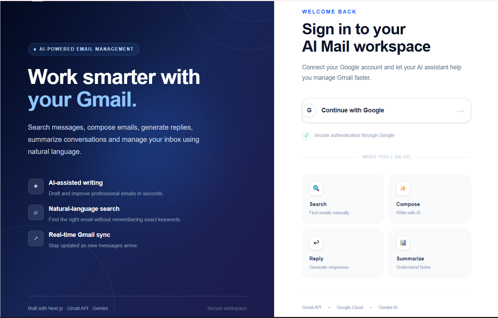
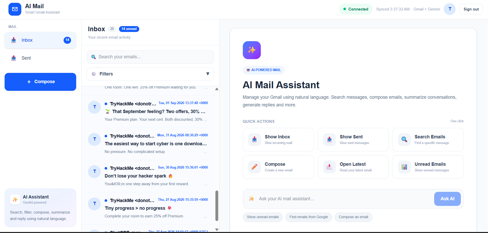
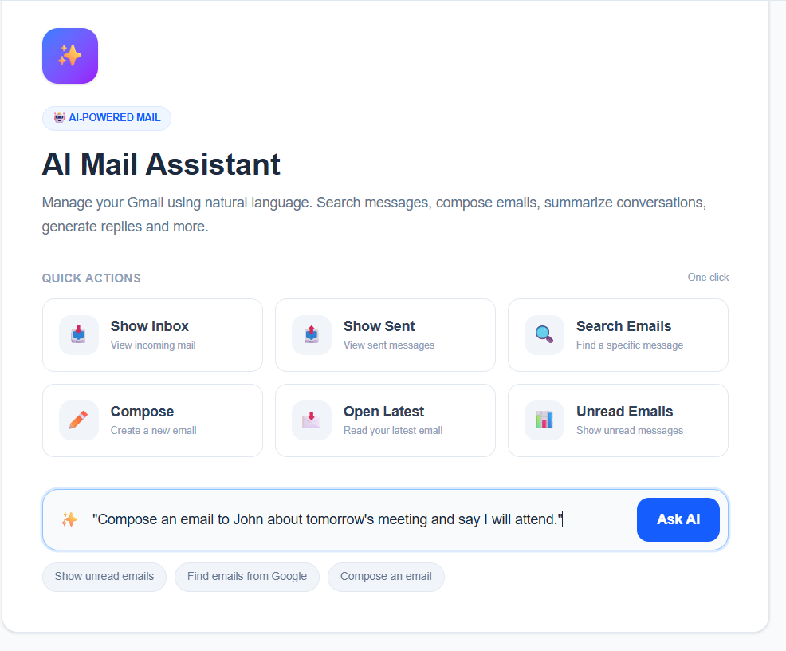
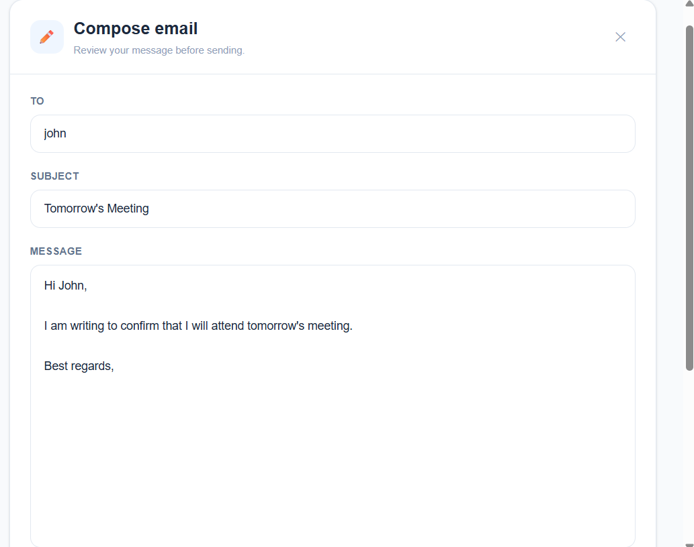
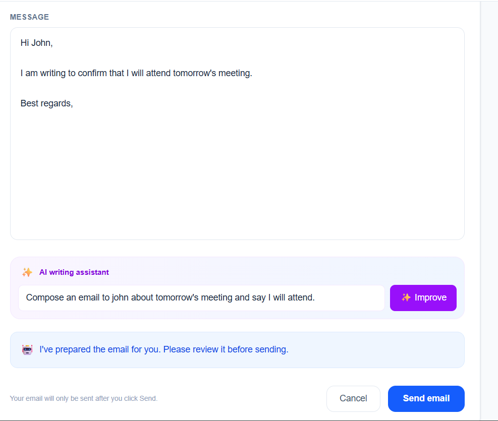
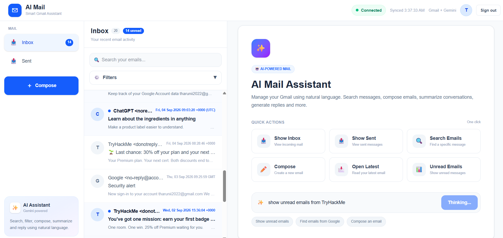
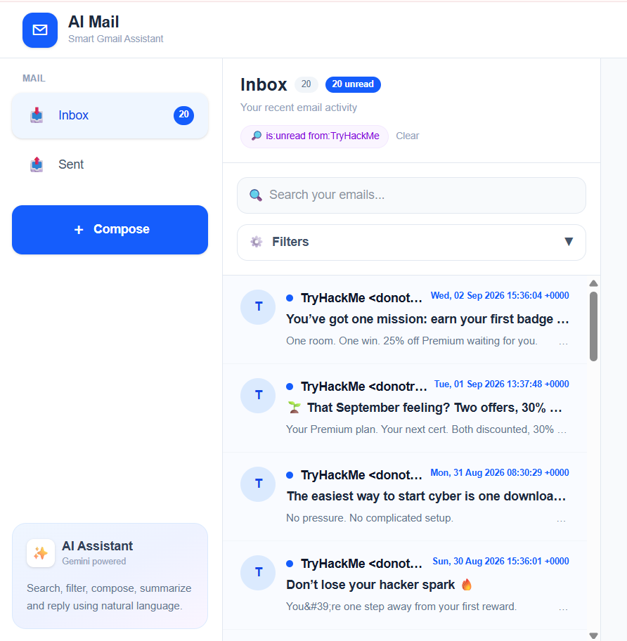
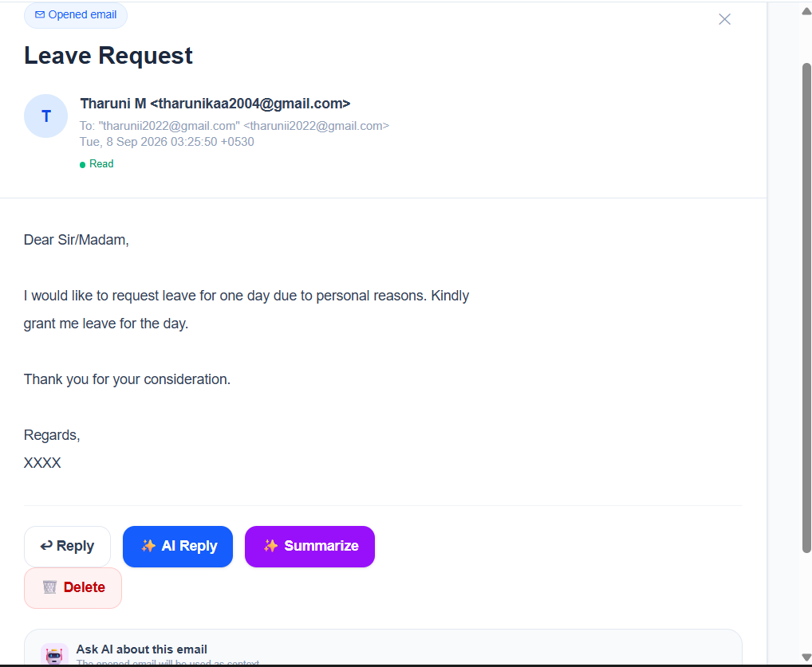
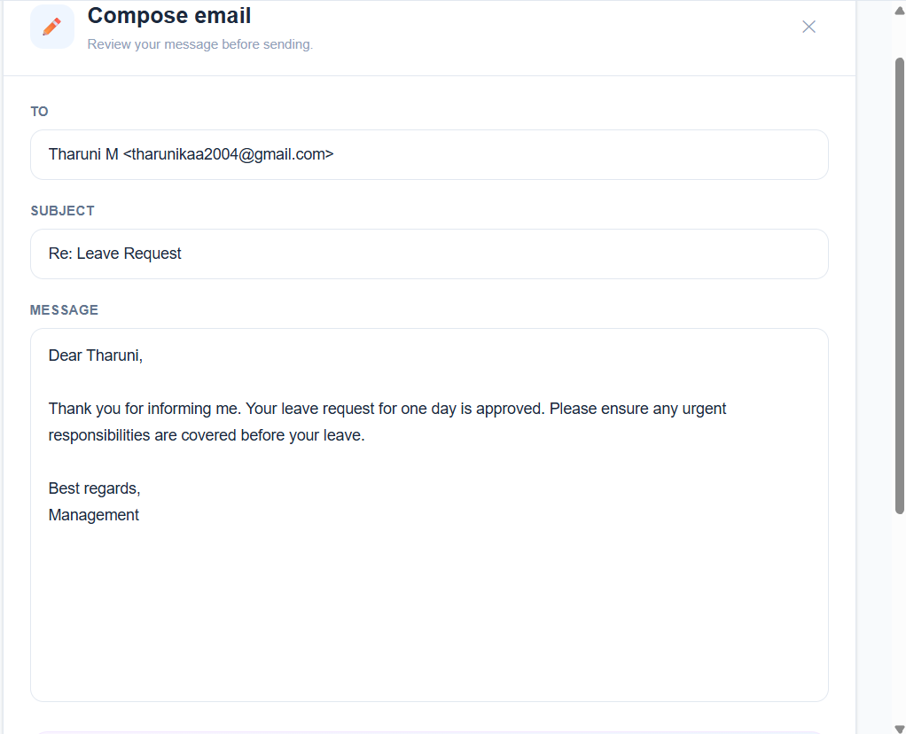
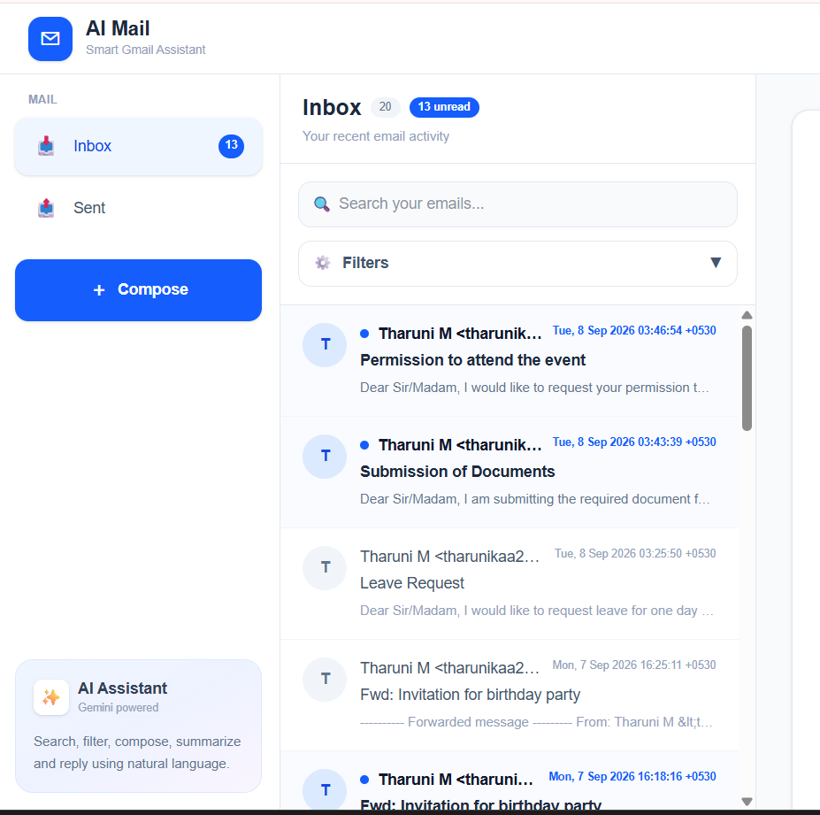

# AI Mail Assistant

AI Mail Assistant is an AI-powered Gmail web application that allows users to manage their emails through a modern web interface and interact with Gmail using natural language commands.

The application integrates the Gmail API for real email operations and Google Gemini for understanding user commands. Instead of using the AI assistant only as a chatbot, the assistant directly controls the application UI by performing actions such as composing emails, filling email fields, searching emails, applying filters, opening messages, navigating between Inbox and Sent, and generating context-aware replies.

The system also supports real-time Gmail synchronization using Gmail Watch, Google Cloud Pub/Sub, and a webhook so that new email activity can be reflected in the application without requiring a manual page refresh.

## Main Objectives

- Integrate the application with a real Gmail account.
- Provide Inbox, Sent, email viewing, composing, and sending functionality.
- Allow users to control email-related actions using natural language.
- Apply AI-powered search and filtering through the application UI.
- Provide context-aware email replies.
- Synchronize Gmail changes in near real time.
## Key Features

### Gmail Integration
- Secure Google sign-in using NextAuth.js and OAuth 2.0.
- Real integration with Gmail using the Gmail API.
- Access and manage emails from the user's Gmail account.

### Email Management
- View Inbox and Sent folders.
- Open and read individual emails.
- Automatically mark unread emails as read when opened.
- Compose and send emails.
- Delete emails.

### AI-Powered Email Assistant
- Understand natural language email commands using Google Gemini.
- Compose emails by automatically filling recipient, subject, and body fields.
- Search emails using natural language.
- Apply email filters using natural language.
- Navigate between Inbox and Sent through AI commands.
- Open a specific email through the assistant.
- Generate context-aware replies based on the selected email.
- Summarize email content.

### AI-Controlled User Interface
The assistant does not only return chatbot responses. It translates natural language commands into application actions and directly updates the relevant UI components.

Examples:
- "Compose an email to John about tomorrow's meeting."
- "Show unread emails from my manager."
- "Open the latest email."
- "Reply to this email saying I will attend."
- "Show my sent emails."

### Real-Time Synchronization
- Gmail Watch is used to monitor mailbox changes.
- Google Cloud Pub/Sub delivers Gmail change notifications.
- A webhook receives the notifications in the application.
- Gmail History API is used to detect mailbox changes.
- The application updates the displayed emails without requiring a manual page refresh.
## AI Controls the UI

The AI assistant is designed to control the application's user interface rather than functioning only as a conversational chatbot.

Users can give natural language commands, and Google Gemini interprets the request and maps it to the appropriate application action. The application then updates the UI and performs the corresponding Gmail operation.

### Supported AI Actions

| User Command | AI Action | UI Result |
|---|---|---|
| "Open my inbox" | `VIEW_INBOX` | Navigates to Inbox |
| "Show my sent emails" | `VIEW_SENT` | Navigates to Sent |
| "Search emails from John" | `SEARCH_EMAILS` | Displays matching emails |
| "Show unread emails" | `FILTER_EMAILS` | Applies the requested filter |
| "Open the latest email" | `OPEN_EMAIL` | Opens the selected email |
| "Compose an email to John" | `COMPOSE_EMAIL` | Opens Compose and fills the fields |
| "Improve this email" | `IMPROVE_EMAIL` | Improves the email content |
| "Reply saying I will attend" | `REPLY_EMAIL` | Generates a context-aware reply |
| "Summarize this email" | `SUMMARIZE_EMAIL` | Displays an email summary |

### Example

A user can enter:

> "Compose an email to John about tomorrow's meeting and say that I will attend."

The assistant interprets the request and automatically:

1. Opens the Compose interface.
2. Fills the recipient field.
3. Generates the subject.
4. Writes the email body.
5. Displays the completed email in the UI.

This approach makes the assistant an interactive control layer for the mail application, allowing users to perform common email tasks through natural language.

## Screenshots / Demo

### 1. Login

The application starts with a secure Google sign-in screen.

### 2. Gmail Dashboard

The dashboard provides access to Inbox, Sent, email search, filters, Compose, and the AI assistant.

### 3. AI Compose and UI Control

The AI assistant interprets a natural language command and automatically opens the Compose interface and fills the recipient, subject, and message fields.

### 4. AI Search and Filtering

Users can request email searches and filters using natural language, and the application updates the email list accordingly.

### 5. Context-Aware Reply

The AI assistant uses the currently opened email as context to generate an appropriate reply.

### 6. Real-Time Gmail Synchronization

New Gmail messages are detected through Gmail Watch and Google Cloud Pub/Sub and reflected in the application without manually refreshing the page.

## Tech Stack

### Frontend
- Next.js
- React
- TypeScript
- Tailwind CSS

### Authentication
- NextAuth.js
- Google OAuth 2.0

### Backend and APIs
- Next.js API Routes
- Gmail API
- Gmail History API

### AI
- Google Gemini API

### Real-Time Synchronization
- Gmail Watch
- Google Cloud Pub/Sub
- Pub/Sub Webhook

### Development Tools
- Node.js
- npm
- Git
- GitHub

## Architecture

The application follows a client-server architecture where the Next.js application acts as the main frontend and backend layer. Gmail API handles real email operations, Google Gemini handles natural language understanding, and Google Cloud Pub/Sub enables real-time Gmail notifications.

### Architecture Flow

                         ┌──────────────────────┐
                         │       User           │
                         │ Natural Language     │
                         │ Commands / UI        │
                         └──────────┬───────────┘
                                    │
                                    ▼
                         ┌──────────────────────┐
                         │   Next.js Web App    │
                         │ React + TypeScript   │
                         │    Tailwind CSS      │
                         └───────┬───────┬──────┘
                                 │       │
                    ┌────────────┘       └──────────────┐
                    ▼                                   ▼
          ┌──────────────────┐                 ┌──────────────────┐
          │   Gmail API      │                 │   Gemini API     │
          │                  │                 │                  │
          │ Read / Search    │                 │ Understand       │
          │ Send / Delete   │                 │ Commands         │
          │ Mark as Read     │                 │ Generate Replies │
          └────────┬─────────┘                 └──────────────────┘
                   │
                   │ Gmail Watch
                   ▼
          ┌──────────────────┐
          │ Google Cloud     │
          │ Pub/Sub          │
          └────────┬─────────┘
                   │
                   │ Notification
                   ▼
          ┌──────────────────┐
          │ Gmail Push       │
          │ Webhook          │
          └────────┬─────────┘
                   │
                   ▼
          ┌──────────────────┐
          │ Gmail History    │
          │ API Sync         │
          └────────┬─────────┘
                   │
                   ▼
          ┌──────────────────┐
          │ Update Next.js   │
          │ Email UI         │
          └──────────────────┘

| Component            | Responsibility                                                   |
| -------------------- | ---------------------------------------------------------------- |
| Next.js / React      | Provides the web interface and manages application state         |
| Next.js API Routes   | Handles server-side Gmail and AI operations                      |
| NextAuth.js          | Handles Google authentication and OAuth 2.0                      |
| Gmail API            | Reads, searches, sends, modifies, and deletes Gmail messages     |
| Gemini API           | Interprets natural language commands and generates email content |
| Gmail Watch          | Monitors Gmail mailbox changes                                   |
| Google Cloud Pub/Sub | Delivers Gmail change notifications                              |
| Push Webhook         | Receives Pub/Sub notifications                                   |
| Gmail History API    | Identifies changes that occurred in the mailbox                  |
### AI Control Flow
User Command
     ↓
Gemini API
     ↓
Action + Parameters
     ↓
Next.js Application
     ↓
UI Update / Gmail Operation

For example, when the user says:

> "Compose an email to John about tomorrow's meeting."
> Gemini identifies the required action and email details. The Next.js application then opens the Compose interface and populates the relevant fields in the UI.

### Real-Time Sync Flow
New Gmail Email
      ↓
Gmail Watch
      ↓
Google Cloud Pub/Sub
      ↓
/api/gmail/push
      ↓
Gmail History API
      ↓
Fetch Updated Emails
      ↓
Update Inbox UI

## Architecture Decisions & Trade-offs

### Next.js for Frontend and Backend

Next.js was selected so that the frontend and backend API routes can be maintained within a single application.

**Advantage:** Simplifies development and keeps Gmail and Gemini API operations close to the UI.

**Trade-off:** A larger application may benefit from separating the backend into an independent service.

### Gmail API for Real Email Operations

The Gmail API is used instead of mock or locally stored email data.

**Advantage:** The application works with the user's actual Gmail mailbox and supports real email operations.

**Trade-off:** OAuth configuration, API permissions, and Google Cloud setup are required.

### Google Gemini for Natural Language Understanding

Gemini is used to interpret natural language commands and return structured actions and parameters.

**Advantage:** Users can interact with the mail application naturally without learning specific commands.

**Trade-off:** AI responses depend on API availability and require an API key.

### Gmail Watch + Google Cloud Pub/Sub

Gmail Watch and Google Cloud Pub/Sub are used for real-time mailbox notifications.

**Advantage:** The application can detect Gmail changes without relying on manual page refreshes.

**Trade-off:** Pub/Sub requires additional Google Cloud configuration and a publicly reachable webhook endpoint during local development.

### LocalTunnel for Local Webhook Testing

LocalTunnel is used during local development to expose the Gmail push webhook to the internet.

**Advantage:** Allows Gmail Pub/Sub to communicate with the local application without requiring an immediate production deployment.

**Trade-off:** The public URL can change when the tunnel is restarted, so a permanent deployment would be more suitable for production.

### Natural Language as the AI Control Layer

The AI assistant translates user requests into predefined application actions such as searching, filtering, composing, opening emails, and generating replies.

**Advantage:** Provides predictable UI control while still allowing natural language interaction.

**Trade-off:** New capabilities require adding and handling additional actions in the application.

## Local Setup

### Prerequisites

- Node.js
- npm
- Git
- Google Cloud project
- Google account with Gmail access
Install Dependencies
npm install
### Configure Google Cloud

Enable the following APIs in your Google Cloud project:

- Gmail API
- Google Cloud Pub/Sub API

Authorized JavaScript origin:

http://localhost:3000

### Real-Time Gmail Webhook

For local development, use LocalTunnel to expose the webhook through HTTPS:

npx localtunnel --port 3000

### Real-Time Gmail Synchronization

The application uses Gmail Watch, Google Cloud Pub/Sub, and the Gmail History API to detect Gmail changes and keep the application updated.

### Synchronization Flow

1. Gmail detects a new email or mailbox change.
2. Gmail sends a notification to Google Cloud Pub/Sub.
3. Pub/Sub forwards the notification to the application's webhook.
4. The webhook uses the Gmail History API to identify the changes.
5. The application updates the email list without requiring a manual page refresh.

### Local Development

For local testing, LocalTunnel is used to expose the webhook through a public HTTPS URL.

npx localtunnel --port 3000

## What I Would Improve With More Time

### 1. Permanent Deployment

Deploy the application to a production environment with a permanent HTTPS URL instead of relying on LocalTunnel for the Gmail webhook.

### 2. Better AI Reliability

Improve the AI action-handling layer with stronger validation, error handling, and support for more complex natural-language commands.

### 3. Enhanced Email Management

Add more advanced Gmail features such as:

- Forwarding emails
- Labels and folders
- Star and archive actions
- Thread-level management

### 4. Improved User Experience

Further improve the interface with richer AI interaction, better loading states, notifications, and smoother email navigation.

### 5. Testing

Add unit tests and integration tests for Gmail operations, AI actions, authentication, filtering, and real-time synchronization.

### 6. Scalability

Improve the architecture for larger-scale usage by introducing better background processing, caching, monitoring, and production-ready infrastructure.
